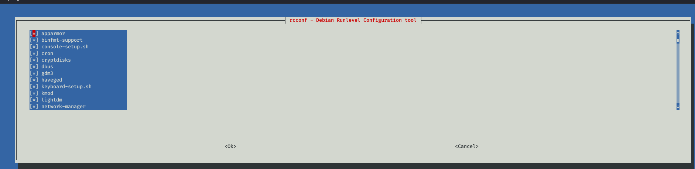

<p align="center">
<font size="20">
  <b>OSCP</b><br>
</font>
 
</p>


# Find File:

**locate**
```
updatedb
```
to update the file index database

```
locate [filename]
```
**which**

find the file which has current execution environment

```
which [part of file name]
```

**find**

powerfull search tool with many arguments

```
find [search location]  -name [filename] -exec file "{}"\;
```

# Service managent:

```
service [service name] [option]

```
option could be : start, stop, or restart

alternatevly you can use:

```
/etc/init.d/[service name] [option]
```

or:

```
update-rc.d [service name] [options]

```

options here are: defaults, remove, start , or stop


**GUI service management:**

rcconf




sysv--rc-conf


# Bash Shell

to automate actions you need to write some shell scripts for example filtring domain names from a html page:

``` 
wget cisco.com 
cat index.html | grep "a href=" | cut -d "/" -f3
```

if you get error *ERROR: The certificate of ‘www.cisco.com’ is not trusted.* just use *wget --no-check-certificate cisco.com*

other method:

``
cat index.html |grep 'http://[^"]*' | cut -d "/" -f 3 |sort -u
```

# direct error to null screen (do not show errors)

```
command 2>/dev/null

```
where:

stdin – 0 – Standard Input (usually keyboard or file)

stdout – 1 – Standard Output (usually screen)

stderr – 2 – Standard Error (usually screen)


# Reverse Hex Dump:

```
xxd -r file > output
```
# login with ssh-private key

```
ssh -i [key file path] user@host

```

# ping sweeper:

```
#! /bin/bash
for ip in $(1 255) do
ping 192.168.1.$ip | grep "bytes from" | cut -d " " -f4 | cut -d ":" -f1 &
```

the & is to send each command to background and run the next on in the loop